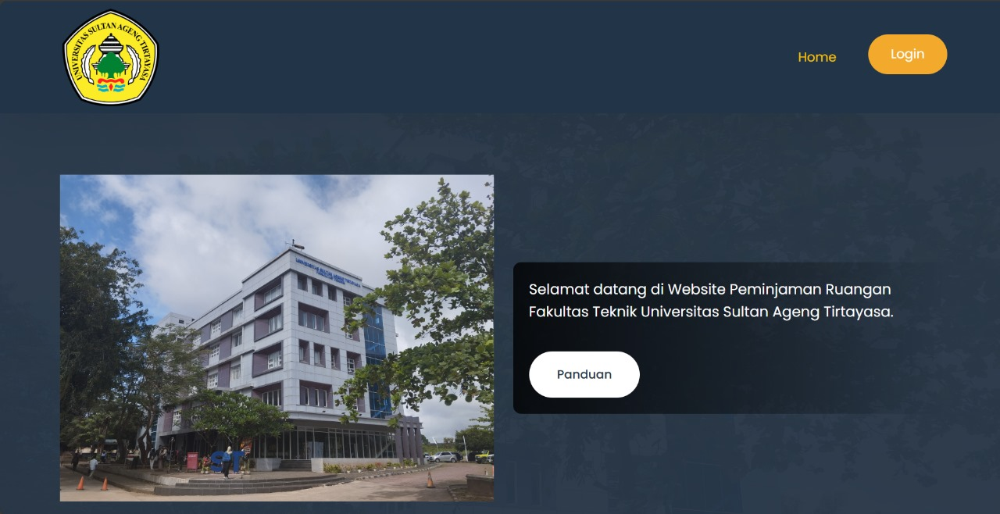
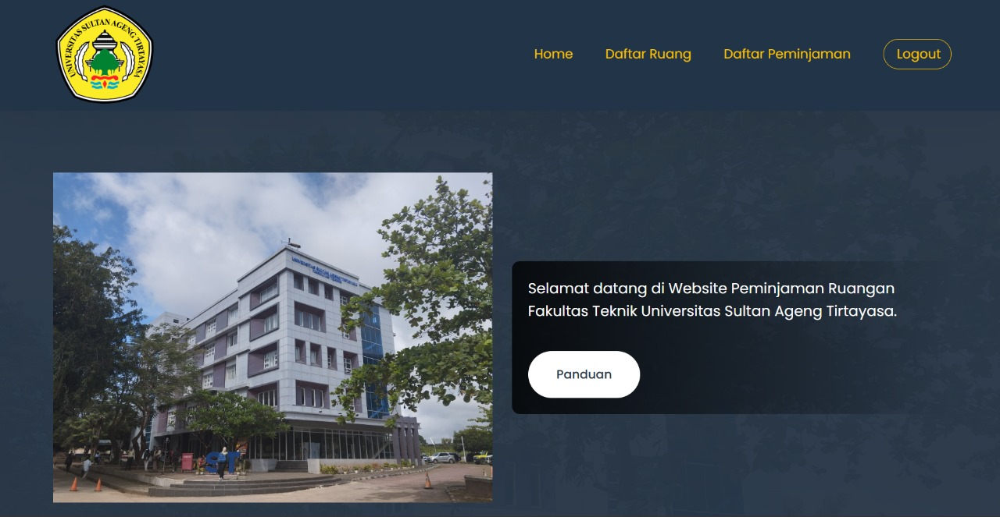
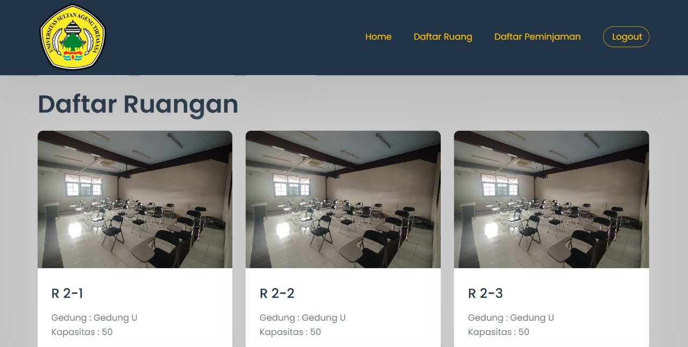
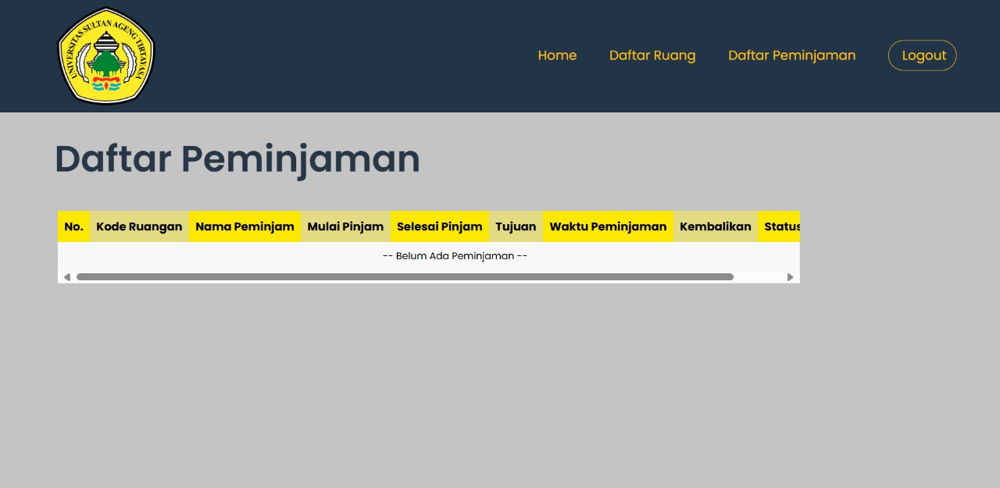

<!-- 
<p align="center"><a href="https://laravel.com" target="_blank"></a></p>
-->

# Peminjaman Ruangan
Web Peminjaman ruangan adalah platform berbasis web yang dirancang untuk memudahkan proses peminjaman ruangan di lingkungan kampus. Aplikasi ini dibangun menggunakan bahasa pemrograman PHP dengan framework Laravel, serta didukung oleh database MySQL. Dengan antarmuka yang sederhana dan fungsional, pengguna dapat melihat ketersediaan ruangan, melakukan reservasi dengan cepat, dan mendapatkan konfirmasi secara instan. Fitur-fitur seperti manajemen acara, pembaruan status real-time, dan integrasi data yang solid membuat sistem ini cocok digunakan oleh institusi pendidikan atau organisasi dengan banyak ruang kegiatan.
## Preview





## Membutuhkan
- PHP
- Composer
- Laravel
- MySql

## Fitur yang ada
-  Admin
-  Authentication
-  Login (Admin/User)
-  Reserve Room
-  etc

## instalasi
1. Download atau clone project ini.
   ```git
   https://github.com/IsmetMaulanaAzhari/Pinjam_Ruangan
   ```
2. Pindah ke dalam folder `Pinjam-Ruang`.
   ```sh
   cd Pinjam_Ruangan
   ```
3. Install komponen yang diperlukan menggunakan composer.
   ```sh
   composer install
   ```
4. Jika composer install tidak bisa jalan, maka kamu harus mengupdate composer terlebih dahulu.
   ```sh
   composer update
   ```
4. Ubah file `.env.example` menjadi `.env`(kamu juga bisa merubah nama database sesuai keinginan kamu).
   ```sh
   cp .env.example .env
   ```
5. Jika mysql atau database yang kamu gunakan tidak menggunakan password maka hapus bagian passwordnya
   ```sh
   DB_PASSWORD=admin123 menjadi DB_PASSWORD=
   ```
6. Buatlah `APP_KEY`.
   ```sh
   php artisan key:generate
   ```
7. Install Storage.
   ```sh
   php artisan storage:link
   ```
8. Lakukan migrasi database.
   ```sh
   php artisan migrate:fresh --seed
   ```
9. Setelah migrasi database telah berhasil, jalankan aplikasinya.
   ```sh
   php artisan serve
   ```
10. Buka browser anda dan buka `127.0.0.1:8000` untuk menggunakan aplikasinya.
   
11. Login:
    - email: 3337230060@untirta.ac.id password: rama1029 -> User
    - email: 3337230014@untirta.ac.id password: ismetgalon -> User
    - email: 3337230004@untirta.ac.id password: fadlykatsunci -> admin
    - email: 3337230069@untirta.ac.id password: ezrateriosmerah -> User
