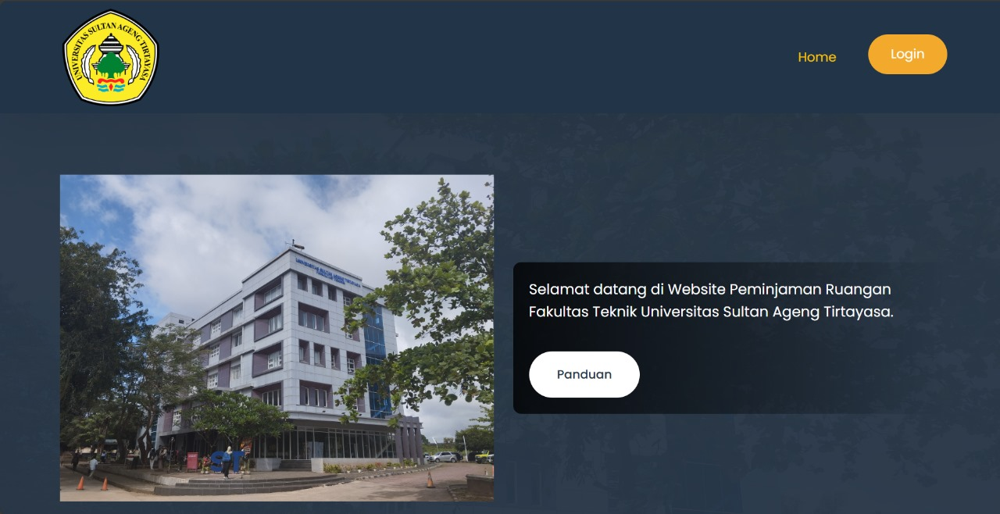
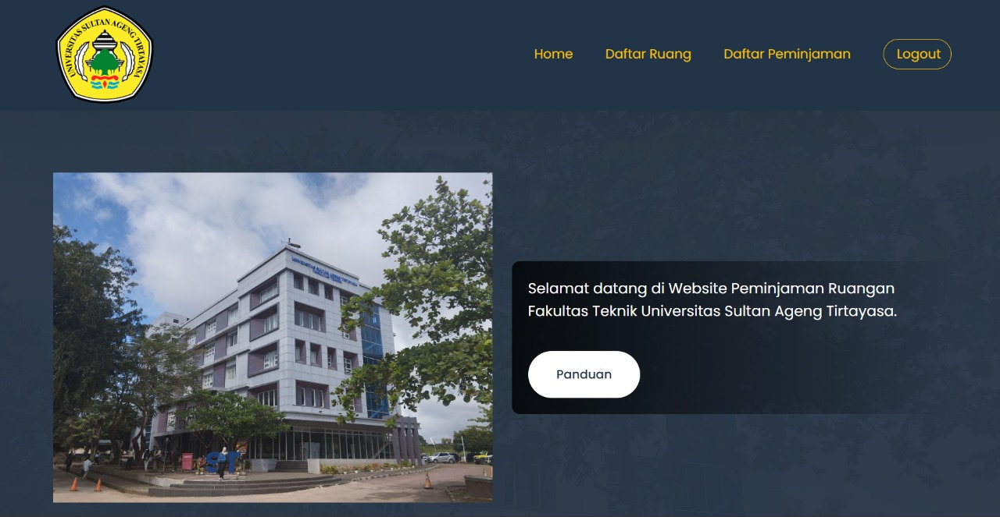
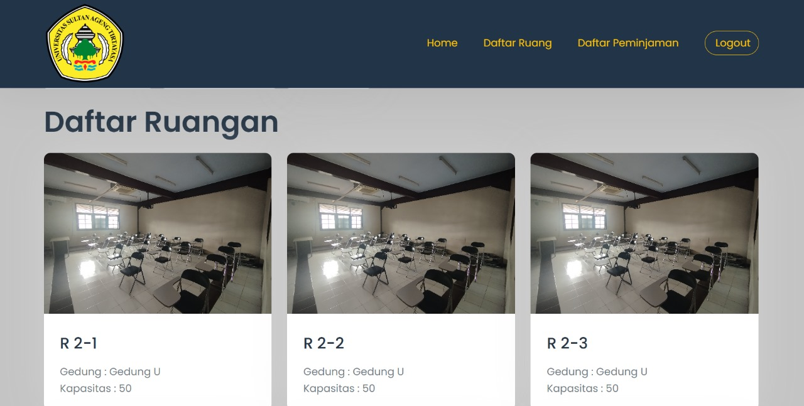
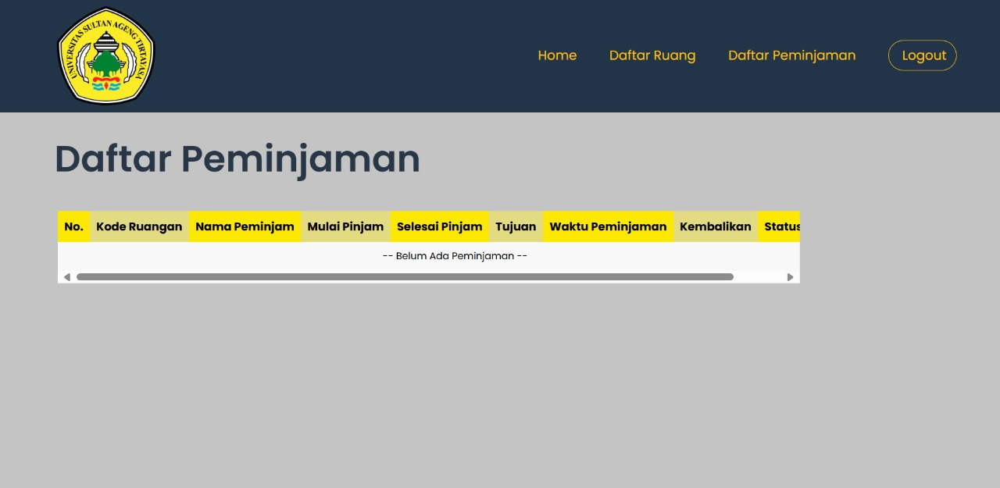

<p align="center">
  
</p>

<h1 align="center">🏢 Sistem Peminjaman Ruangan</h1>

<p align="center">
  <b>Platform berbasis web untuk memudahkan proses peminjaman ruangan di lingkungan kampus</b>
</p>

<p align="center">
  
  
  
  
</p>

---

## 📋 Deskripsi

**Sistem Peminjaman Ruangan** adalah aplikasi web yang dirancang untuk memudahkan proses peminjaman ruangan di lingkungan kampus Universitas Teknokrat Indonesia. 

Aplikasi ini dibangun menggunakan:
- **Backend**: PHP dengan framework Laravel 9
- **Database**: MySQL
- **Frontend**: Bootstrap 5 + jQuery

Dengan antarmuka yang sederhana dan fungsional, pengguna dapat:
- ✅ Melihat ketersediaan ruangan secara real-time
- ✅ Melakukan reservasi dengan cepat
- ✅ Mendapatkan konfirmasi status peminjaman
- ✅ Mengelola data ruangan (admin)

---

## 📸 Preview Aplikasi

| Halaman Utama | Dashboard Admin |
|:-------------:|:---------------:|
|  |  |

| Daftar Ruangan | Form Peminjaman |
|:--------------:|:---------------:|
|  |  |

---

## ⚙️ Persyaratan Sistem

Pastikan komputer Anda sudah terinstall:

| Software | Versi Minimum | Keterangan |
|----------|--------------|------------|
| PHP | 8.0.2+ | Bahasa pemrograman utama |
| Composer | 2.x | Package manager PHP |
| MySQL | 5.7+ | Database server |
| Node.js | 14+ | (Opsional) Untuk compile assets |

---

## 🚀 Fitur Utama

### 👤 Untuk User (Mahasiswa/Dosen)
- 🔐 Login & Register
- 📋 Lihat daftar ruangan yang tersedia
- 📝 Ajukan peminjaman ruangan
- 📊 Lihat riwayat peminjaman

### 👨‍💼 Untuk Admin
- 📊 Dashboard overview
- 🏠 Kelola data ruangan (CRUD)
- 👥 Kelola data user & admin
- ✅ Approve/Reject permintaan peminjaman
- 📈 Lihat semua transaksi peminjaman

---

## 📦 Instalasi

### Langkah 1: Clone Repository

```bash
git clone https://github.com/IsmetMaulanaAzhari/Pinjam_Ruangan.git
```

### Langkah 2: Masuk ke Folder Project

```bash
cd Pinjam_Ruangan
```

### Langkah 3: Install Dependencies

```bash
composer install
```

> 💡 **Tips**: Jika terjadi error, coba jalankan `composer update` terlebih dahulu.

### Langkah 4: Konfigurasi Environment

```bash
# Copy file environment
cp .env.example .env

# Atau di Windows
copy .env.example .env
```

### Langkah 5: Konfigurasi Database

Buka file `.env` dan sesuaikan konfigurasi database:

```env
DB_CONNECTION=mysql
DB_HOST=127.0.0.1
DB_PORT=3306
DB_DATABASE=pinjam_ruangan    # Nama database (buat dulu di MySQL)
DB_USERNAME=root              # Username MySQL Anda
DB_PASSWORD=                  # Password MySQL (kosongkan jika tidak ada)
```

### Langkah 6: Generate Application Key

```bash
php artisan key:generate
```

### Langkah 7: Setup Storage Link

```bash
php artisan storage:link
```

### Langkah 8: Migrasi Database

```bash
php artisan migrate:fresh --seed
```

> ⚠️ **Peringatan**: Perintah ini akan menghapus semua data dan membuat ulang tabel dengan data dummy.

### Langkah 9: Jalankan Aplikasi

```bash
php artisan serve
```

### Langkah 10: Akses Aplikasi

Buka browser dan akses: **http://127.0.0.1:8000**

---

## 🔑 Akun Default

Setelah instalasi, Anda dapat login menggunakan akun berikut:

### Admin
| Field | Value |
|-------|-------|
| Email | `3337230014@untirta.ac.id` |
| Password | `ismet` |

### User (Mahasiswa)
| Field | Value |
|-------|-------|
| Email | `3337230060@untirta.ac.id` |
| Password | `rama1029` |

---

## 📂 Struktur Folder

```
Pinjam_Ruangan/
├── app/
│   ├── Http/Controllers/    # Controller aplikasi
│   ├── Models/              # Model database
│   └── ...
├── database/
│   ├── migrations/          # File migrasi database
│   └── seeders/             # Data dummy untuk testing
├── public/
│   ├── img/                 # Gambar statis
│   ├── js/                  # File JavaScript
│   └── css/                 # File CSS
├── resources/
│   └── views/               # File Blade template
├── routes/
│   └── web.php              # Routing aplikasi
└── ...
```

---

## 🛠️ Troubleshooting

### Error: "No application encryption key has been specified"
```bash
php artisan key:generate
```

### Error: "SQLSTATE[HY000] [1045] Access denied"
Periksa konfigurasi database di file `.env`

### Error: "Class not found"
```bash
composer dump-autoload
```

### Gambar tidak muncul
```bash
php artisan storage:link
```
